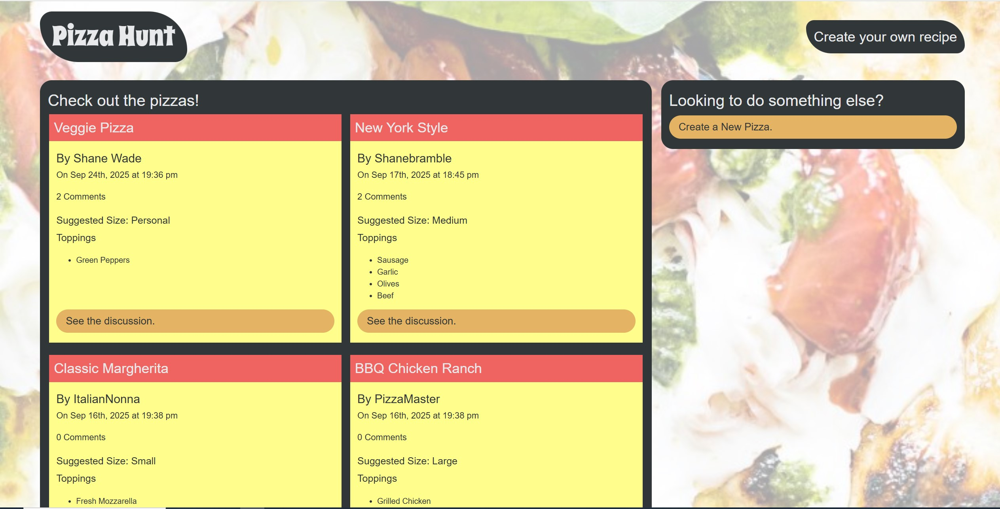

# Pizza Hunt

Pizza Hunt is a full-stack web application that allows users to share and discuss their favorite pizza recipes. Users can create posts, comment on others' pizzas, and interact with the pizza-loving community.

## Features

- Create, read, update, and delete pizza posts
- Comment on pizza posts
- Responsive design for desktop and mobile
- RESTful API backend

## Technologies Used

- Node.js
- Express.js
- MongoDB & Mongoose
- JavaScript (ES6+)
- HTML & CSS

## Installation

1. Clone the repository:

    ```bash
    git clone https://github.com/your-username/pizza-hunt.git
    ```

2. Install dependencies:

    ```bash
    npm install
    ```

3. Start the server:

    ```bash
    npm start
    ```

## Usage



- Visit `http://localhost:3001` in your browser.
- Create an account and start sharing your favorite pizzas!

## Contributing

Pull requests are welcome. For major changes, please open an issue first to discuss what you would like to change.

Created by Shane Bramble-Wade

## Project Status

Project is: _in progress_

## License

This project is licensed under the MIT License.

## Contact

Created by [@kranniax](https://twitter.com/kranniax) - feel free to contact
